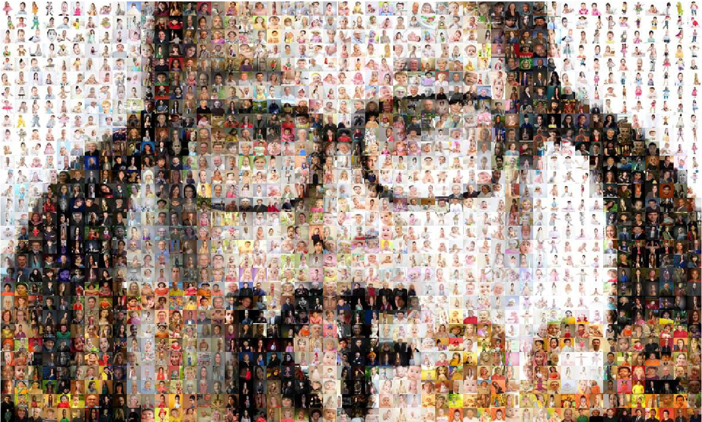
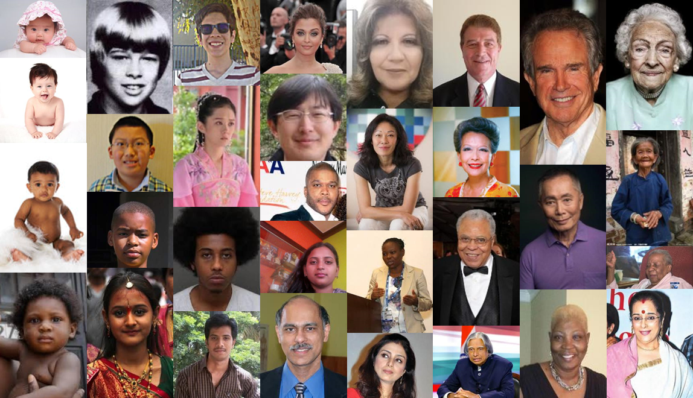

## Introduction

UTKFace dataset is a large-scale face dataset with long age span (range from 0 to 116 years old). The dataset consists of over 20,000 face images with annotations of age, gender, and ethnicity. The images cover large variation in pose, facial expression, illumination, occlusion, resolution, etc. This dataset could be used on a variety of tasks, e.g., face detection, age estimation, age progression/regression, landmark localization, etc. Some sample images are shown as following

## Highlights

* consists of 20k+ face images in the wild (only single face in one image)
* provides the correspondingly aligned and cropped faces
* provides the corresponding landmarks (68 points)
* images are labelled by age, gender, and ethnicity

## Samples


## Datasets

| [In-the-wild Faces](https://drive.google.com/drive/folders/0BxYys69jI14kSVdWWllDMWhnN2c?resourcekey=0-ggVWHnjAh10-XkUZctjQ-w&usp=sharing) | [Aligned&Cropped Faces](https://drive.google.com/drive/folders/0BxYys69jI14kU0I1YUQyY1ZDRUE?usp=sharing) | [Landmarks (68 points)](https://drive.google.com/open?id=0BxYys69jI14kS1lmbW1jbkFHaW8) |
| :---: | :---: | :---: |
|  |  |  
| [ZIP File (1.3GB)](https://drive.google.com/open?id=0BxYys69jI14kSVdWWllDMWhnN2c) | [ZIP File (107MB)](https://drive.google.com/drive/folders/0BxYys69jI14kU0I1YUQyY1ZDRUE?usp=sharing) |  [TXT File (12MB)](https://drive.google.com/open?id=0BxYys69jI14kS1lmbW1jbkFHaW8) |

## Labels

The labels of each face image is embedded in the file name, formated like `[age]_[gender]_[race]_[date&time].jpg`

* `[age]` is an integer from 0 to 116, indicating the age
* `[gender]` is either 0 (male) or 1 (female)
* `[race]` is an integer from 0 to 4, denoting White, Black, Asian, Indian, and Others (like Hispanic, Latino, Middle Eastern).
* `[date&time]` is in the format of yyyymmddHHMMSSFFF, showing the date and time an image was collected to UTKFace

## Parse Landmarks
In the folder [readFaceLandmark](https://drive.google.com/file/d/10I06TBSbQZ3XgwKinrt1kZzpmUKmc_iW/view?usp=sharing), a demo code [`read_face_landmark.m`](https://drive.google.com/file/d/10I06TBSbQZ3XgwKinrt1kZzpmUKmc_iW/view?usp=sharing)
in Matlab is provided to parse the landmarks and plot landmarks on `Aligned&Cropped Faces`. To run the demo, just type 

```
>> read_face_landmark
```

## License Claim

* The UTKFace dataset is avaiable for non-commercial research purposes only.
* The aligned and cropped images, as well as landmarks, are obtained by [Dlib](http://dlib.net/).
* Please note that all the images are collected from the Internet which are not property of [AICIP](http://aicip.eecs.utk.edu/wiki/Main_Page). AICIP is not responsible for the content nor the meaning of these images.
* The copyright belongs to the original owners. If any of the images belongs to you, please let us know and we will remove it from our dataset immediately. 
* The ground truth of age, gender and race are estimated through the [DEX](https://data.vision.ee.ethz.ch/cvl/rrothe/imdb-wiki/)  algorithm and double checked by a human annotator. If you find anything inaccurate, please let us know.
## Related Work
[Age Progression/Regression by Conditional Adversarial Autoencoder](https://arxiv.org/abs/1702.08423)

```
@inproceedings{zhifei2017cvpr,
  title={Age Progression/Regression by Conditional Adversarial Autoencoder},
  author={Zhang, Zhifei, Song, Yang, and Qi, Hairong},
  booktitle={IEEE Conference on Computer Vision and Pattern Recognition (CVPR)},
  year={2017},
  organization={IEEE}
}
```

## Contact
Please contact [Yang Song](http://web.eecs.utk.edu/~ysong18/) or [Zhifei Zhang](http://web.eecs.utk.edu/~zzhang61/) for questions.
